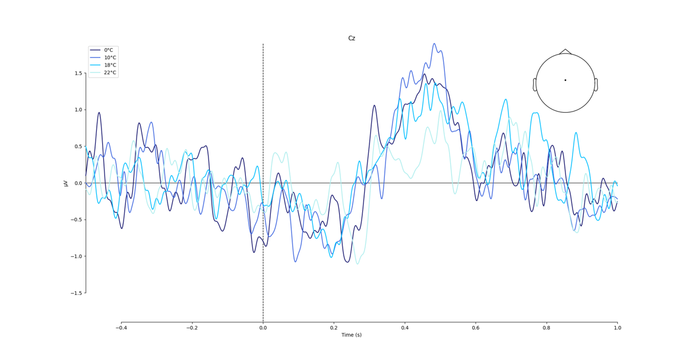
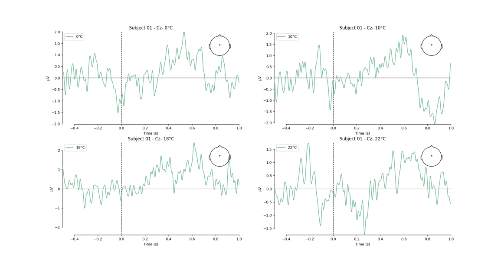
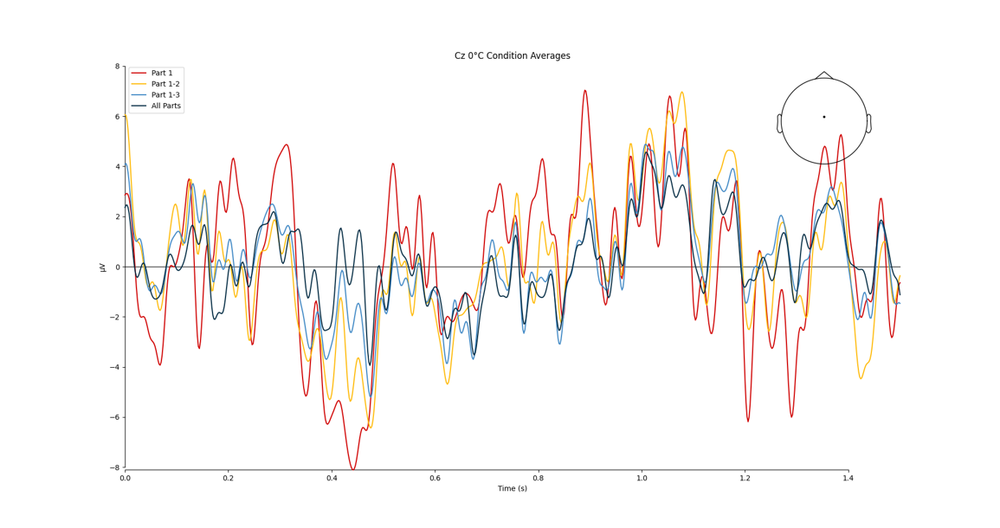
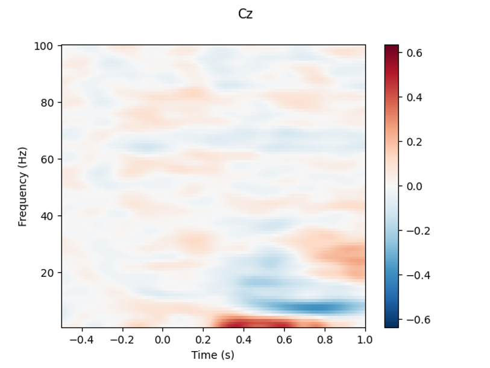

# EEG Analysis Pipeline

## Overview

This repository contains Python scripts for preprocessing and analyzing EEG data collected under various experimental conditions (0°C, 10°C, 18°C, 22°C). The project focuses on data quality improvement, artifact removal, and analysis of Event-Related Potentials (ERPs). The pipeline includes loading raw EEG data, signal enhancement, Independent Component Analysis (ICA), artifact rejection, and condition-specific analyses.

## Pipeline Description

### Preprocessing Steps
1. **Data Loading and Initial Inspection**:
   - Import raw EEG data and inspect initial characteristics.
   - Concatenate data from multiple runs.

2. **Signal Enhancement**:
   - High-pass filter (1 Hz): Removes slow signal drifts.
   - Low-pass filter (120 Hz): Preserves relevant frequencies up to 100 Hz.
   - Notch filter (50 Hz): Eliminates power line interference.

3. **Re-referencing**:
   - Signals are re-referenced to the average reference.

4. **Epoching and Quality Control**:
   - Segment continuous data into discrete time windows.
   - Perform manual rejection of problematic epochs (<5% per subject).

5. **Optimization**:
   - Downsample data to 500 Hz to reduce computational load.

6. **Independent Component Analysis (ICA)**:
   - Decomposes EEG data into independent components.
   - Identifies and removes components related to eye and muscle artifacts.

7. **Artifact Detection**:
   - Automatic rejection of epochs with amplitudes exceeding 100 µV.

---

### Analysis Workflow

1. **Time Window Selection**:
   - Focuses on a time window from -0.5 to 1 second relative to the event.

2. **Single-Subject Analysis**:
   - Computes average ERPs for each condition (0°C, 10°C, 18°C, 22°C).
   - Baseline correction is applied if necessary.

3. **Group-Level Analysis**:
   - Combines single-subject averages to compute group-level averages for each condition.

---

## Repository Structure

**scripts/** - Contains Python scripts for each preprocessing and analysis step:
- `1_filtering.py` - Performs filtering and signal enhancement. 
- `2_resampling_epoching.py` - Resamples data and segments it into epochs. 
- `3_ICA.py` - Runs Independent Component Analysis (ICA). 
- `4_ICA_plots.py` - Visualizes ICA components and artifact rejection. 
- `5_evoked_plots.py` - Generates evoked response plots. 
- `6_averages.py` - Computes condition-specific averages. 
- `7_averages_parts.py` - Analyzes data across experimental parts. 
- `8_TFRs.py` - Performs time-frequency analysis.

---

## Results

## Visualizations of Analysis

Below are example visualizations generated from the EEG analysis pipeline. Note that while the signals have undergone rigorous preprocessing and cleaning, including artifact rejection and independent component analysis, some artifacts and irregularities remain due to issues likely stemming from data acquisition equipment, particularly in shielding.

### Group-Level ERP Averages for Cz electrode
This plot shows the averaged Event-Related Potentials (ERPs) for all experimental conditions (0°C, 10°C, 18°C, 22°C) at electrode Cz across all subjects. The time range is from -0.5 to 1 second relative to the event onset (time = 0). Peaks in the waveforms correspond to neural responses to the stimulus. The variability in signal amplitudes reflects differences between experimental conditions. Despite preprocessing, some noise persists, likely related to data acquisition.



### Single-Subject ERP Comparison
This figure presents single-subject ERP waveforms at electrode Cz for all four temperature conditions. Each subplot corresponds to a specific condition. While individual patterns are visible, the overall signal is noisier compared to group averages, highlighting the impact of inter-subject variability and inherent challenges in single-subject analyses.



### Condition-Specific Averaging Across Parts
This plot visualizes the averaged ERP waveforms for the 0°C condition at electrode Cz, broken down into separate parts of the experimental session (e.g., Part 1, Part 1-2). The aggregated average (All Parts) is also shown for comparison. This highlights potential habituation effects or temporal variability across the experimental session.



### Time-Frequency Representation (TFR)
The time-frequency representation (TFR) provides a power spectral analysis of the EEG signal at electrode Cz. It shows changes in power across frequencies (0-100 Hz) over time, relative to the event onset. Red and blue regions indicate increases and decreases in power, respectively. This visualization helps to identify event-related power changes in specific frequency bands, such as theta or alpha rhythms.



---

## How to Use

1. Clone the repository:
   ```bash
   git clone https://github.com/ivanamarijanovic/EEG-Analysis-Pipeline.git
   cd EEG-Analysis-Pipeline

2. Install dependencies:
   ```bash
	pip install -r requirements.txt

3. Run the scripts in order, starting from 1_filtering.py. Ensure that data paths and subject IDs are correctly configured.
